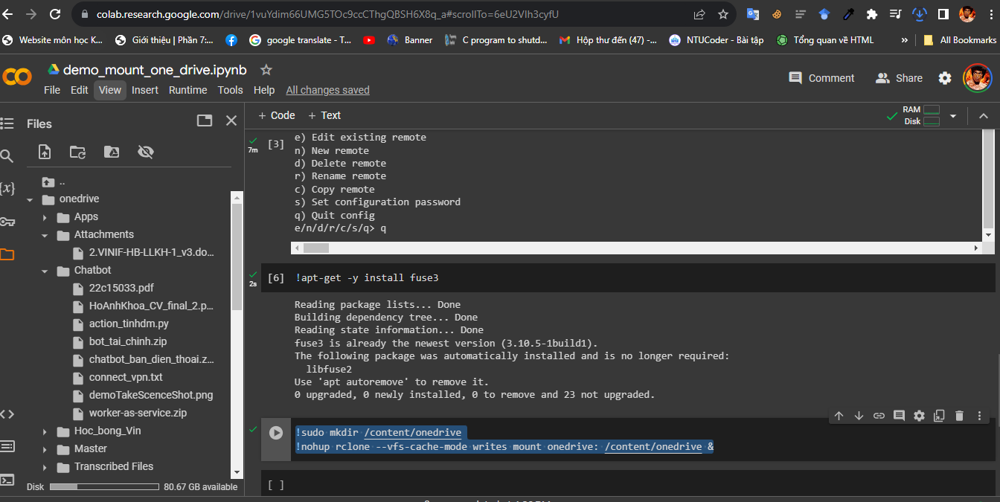
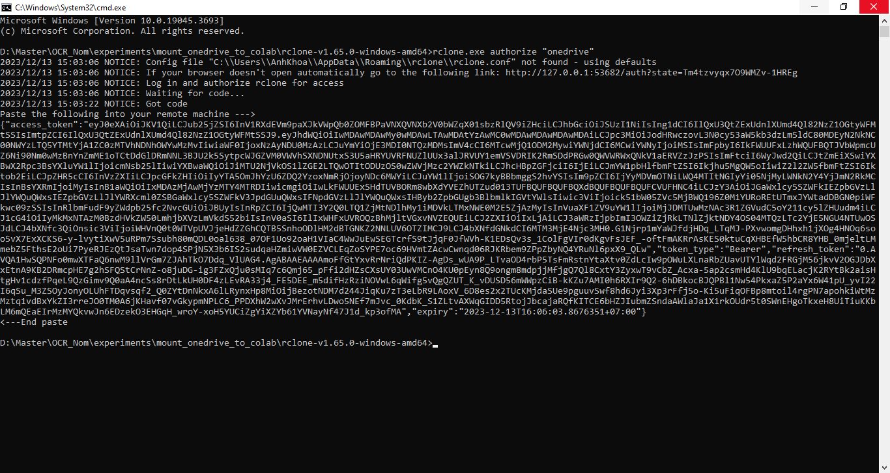

# Mount onedrive với GG Colab

## Tải rclone về máy và lấy token
### Tải rclone
Truy cập vào trang web: https://rclone.org/downloads/ 
Chọn đúng hệ điều hành của mình và tải xuống.
Máy mình là Windows nên mình tải windows về.
Sau đó, giải nén.

### Lấy token
1. Truy cập đến thư mục này: D:\Master\OCR_Nom\experiments\mount_onedrive_to_colab
2. Mở cmd
3. gõ :
```sh 
rclone.exe authorize "onedrive"
```
Rồi nhấn `Enter`.
4. Điền onedrive của mình vào
5. Copy `remote machine`

## Sử dụng Colab để mount với Onedrive
Link download file colab: https://colab.research.google.com/drive/1vuYdim66UMG5TOc9ccCThgQBSH6X8q_a?usp=sharing
### Chi tiết các cell
1. Cell tải rclone cho colab
```sh
!wget https://downloads.rclone.org/v1.65.0/rclone-v1.65.0-linux-amd64.deb
```
2. Cell cài đặt rclone cho Colab.
```sh
!apt install ./rclone-v1.65.0-linux-amd64.deb
```
3. Cell cấu hình rclone cho Colab
```sh
!rclone config
```
4. Cell cập nhật fuse3 để có thể thích hợp với phiên bản rclone cao nhất
```sh
!apt-get -y install fuse3
```
5. Cell mount drive
```sh
!sudo mkdir /content/onedrive
!nohup rclone --vfs-cache-mode writes mount onedrive: /content/onedrive &
```
### Cách cấu hình rclone trên Colab
```sh
2023/12/13 09:12:44 NOTICE: Config file "/root/.config/rclone/rclone.conf" not found - using defaults
No remotes found, make a new one?
n) New remote
s) Set configuration password
q) Quit config
n/s/q> n

Enter name for new remote.
name> onedrive

Option Storage.
Type of storage to configure.
Choose a number from below, or type in your own value.
 1 / 1Fichier
   \ (fichier)
 2 / Akamai NetStorage
   \ (netstorage)
 3 / Alias for an existing remote
   \ (alias)
 4 / Amazon Drive
   \ (amazon cloud drive)
 5 / Amazon S3 Compliant Storage Providers including AWS, Alibaba, ArvanCloud, Ceph, ChinaMobile, Cloudflare, DigitalOcean, Dreamhost, GCS, HuaweiOBS, IBMCOS, IDrive, IONOS, LyveCloud, Leviia, Liara, Linode, Minio, Netease, Petabox, RackCorp, Rclone, Scaleway, SeaweedFS, StackPath, Storj, Synology, TencentCOS, Wasabi, Qiniu and others
   \ (s3)
 6 / Backblaze B2
   \ (b2)
 7 / Better checksums for other remotes
   \ (hasher)
 8 / Box
   \ (box)
 9 / Cache a remote
   \ (cache)
10 / Citrix Sharefile
   \ (sharefile)
11 / Combine several remotes into one
   \ (combine)
12 / Compress a remote
   \ (compress)
13 / Dropbox
   \ (dropbox)
14 / Encrypt/Decrypt a remote
   \ (crypt)
15 / Enterprise File Fabric
   \ (filefabric)
16 / FTP
   \ (ftp)
17 / Google Cloud Storage (this is not Google Drive)
   \ (google cloud storage)
18 / Google Drive
   \ (drive)
19 / Google Photos
   \ (google photos)
20 / HTTP
   \ (http)
21 / Hadoop distributed file system
   \ (hdfs)
22 / HiDrive
   \ (hidrive)
23 / ImageKit.io
   \ (imagekit)
24 / In memory object storage system.
   \ (memory)
25 / Internet Archive
   \ (internetarchive)
26 / Jottacloud
   \ (jottacloud)
27 / Koofr, Digi Storage and other Koofr-compatible storage providers
   \ (koofr)
28 / Linkbox
   \ (linkbox)
29 / Local Disk
   \ (local)
30 / Mail.ru Cloud
   \ (mailru)
31 / Mega
   \ (mega)
32 / Microsoft Azure Blob Storage
   \ (azureblob)
33 / Microsoft Azure Files
   \ (azurefiles)
34 / Microsoft OneDrive
   \ (onedrive)
35 / OpenDrive
   \ (opendrive)
36 / OpenStack Swift (Rackspace Cloud Files, Blomp Cloud Storage, Memset Memstore, OVH)
   \ (swift)
37 / Oracle Cloud Infrastructure Object Storage
   \ (oracleobjectstorage)
38 / Pcloud
   \ (pcloud)
39 / PikPak
   \ (pikpak)
40 / Proton Drive
   \ (protondrive)
41 / Put.io
   \ (putio)
42 / QingCloud Object Storage
   \ (qingstor)
43 / Quatrix by Maytech
   \ (quatrix)
44 / SMB / CIFS
   \ (smb)
45 / SSH/SFTP
   \ (sftp)
46 / Sia Decentralized Cloud
   \ (sia)
47 / Storj Decentralized Cloud Storage
   \ (storj)
48 / Sugarsync
   \ (sugarsync)
49 / Transparently chunk/split large files
   \ (chunker)
50 / Union merges the contents of several upstream fs
   \ (union)
51 / Uptobox
   \ (uptobox)
52 / WebDAV
   \ (webdav)
53 / Yandex Disk
   \ (yandex)
54 / Zoho
   \ (zoho)
55 / premiumize.me
   \ (premiumizeme)
56 / seafile
   \ (seafile)
Storage> 34

Option client_id.
OAuth Client Id.
Leave blank normally.
Enter a value. Press Enter to leave empty.
client_id> 

Option client_secret.
OAuth Client Secret.
Leave blank normally.
Enter a value. Press Enter to leave empty.
client_secret> 

Option region.
Choose national cloud region for OneDrive.
Choose a number from below, or type in your own string value.
Press Enter for the default (global).
 1 / Microsoft Cloud Global
   \ (global)
 2 / Microsoft Cloud for US Government
   \ (us)
 3 / Microsoft Cloud Germany
   \ (de)
 4 / Azure and Office 365 operated by Vnet Group in China
   \ (cn)
region> 1

Edit advanced config?
y) Yes
n) No (default)
y/n> n

Use web browser to automatically authenticate rclone with remote?
 * Say Y if the machine running rclone has a web browser you can use
 * Say N if running rclone on a (remote) machine without web browser access
If not sure try Y. If Y failed, try N.

y) Yes (default)
n) No
y/n> n

Option config_token.
For this to work, you will need rclone available on a machine that has
a web browser available.
For more help and alternate methods see: https://rclone.org/remote_setup/
Execute the following on the machine with the web browser (same rclone
version recommended):
	rclone authorize "onedrive"
Then paste the result.
Enter a value.
config_token> {"access_token":"eyJ0eXAiOiJKV1QiLCJub25jZSI6InV1RXdEVm9paXJkVWpQb0ZOMFBPaVNXQVNXb2V0bWZqX01sbzRlQV9iZHciLCJhbGciOiJSUzI1NiIsIng1dCI6IlQxU3QtZExUdnlXUmd4Ql82NzZ1OGtyWFMtSSIsImtpZCI6IlQxU3QtZExUdnlXUmd4Ql82NzZ1OGtyWFMtSSJ9.eyJhdWQiOiIwMDAwMDAwMy0wMDAwLTAwMDAtYzAwMC0wMDAwMDAwMDAwMDAiLCJpc3MiOiJodHRwczovL3N0cy53aW5kb3dzLm5ldC80MDEyN2NkNC00NWYzLTQ5YTMtYjA1ZC0zMTVhNDNhOWYwMzMvIiwiaWF0IjoxNzAyNDU0MzAzLCJuYmYiOjE3MDI0NTQzMDMsImV4cCI6MTcwMjQ1ODM2MywiYWNjdCI6MCwiYWNyIjoiMSIsImFpbyI6IkFWUUFxLzhWQUFBQTJVbWpmcUZ6Ni90Nm0wMzBnYnZmME1oTCtDdGlDRmNNL3BJU2k5SytpcWJGZVM0VWVhSXNDNUtxS3U5aHRYUVRFNUZlUUx3alJRVUY1emVSVDRIK2RmSDdPRGw0QWVWRWxQNkV1aERVZzJzPSIsImFtciI6WyJwd2QiLCJtZmEiXSwiYXBwX2Rpc3BsYXluYW1lIjoicmNsb25lIiwiYXBwaWQiOiJiMTU2NjVkOS1lZGE2LTQwOTItODUzOS0wZWVjMzc2YWZkNTkiLCJhcHBpZGFjciI6IjEiLCJmYW1pbHlfbmFtZSI6Ikjhu5MgQW5oIiwiZ2l2ZW5fbmFtZSI6Iktob2EiLCJpZHR5cCI6InVzZXIiLCJpcGFkZHIiOiIyYTA5OmJhYzU6ZDQ2YzoxNmRjOjoyNDc6MWYiLCJuYW1lIjoiSOG7kyBBbmggS2hvYSIsIm9pZCI6IjYyMDVmOTNiLWQ4MTItNGIyYi05NjMyLWNkN2Y4YjJmN2RkMCIsInBsYXRmIjoiMyIsInB1aWQiOiIxMDAzMjAwMjYzMTY4MTRDIiwicmgiOiIwLkFWUUExSHdTUVBORm8wbXdYVEZhUTZud013TUFBQUFBQUFBQXdBQUFBQUFBQUFCVUFHNC4iLCJzY3AiOiJGaWxlcy5SZWFkIEZpbGVzLlJlYWQuQWxsIEZpbGVzLlJlYWRXcml0ZSBGaWxlcy5SZWFkV3JpdGUuQWxsIFNpdGVzLlJlYWQuQWxsIHByb2ZpbGUgb3BlbmlkIGVtYWlsIiwic3ViIjoick51bW05ZVc5MjBWQ196Z0M1YURoREtUTmxJYWtadDBGN0piWFkwc09zSSIsInRlbmFudF9yZWdpb25fc2NvcGUiOiJBUyIsInRpZCI6IjQwMTI3Y2Q0LTQ1ZjMtNDlhMy1iMDVkLTMxNWE0M2E5ZjAzMyIsInVuaXF1ZV9uYW1lIjoiMjJDMTUwMzNAc3R1ZGVudC5oY211cy5lZHUudm4iLCJ1cG4iOiIyMkMxNTAzM0BzdHVkZW50LmhjbXVzLmVkdS52biIsInV0aSI6IlIxWHFxUVROQzBhMjltVGxvNVZEQUEiLCJ2ZXIiOiIxLjAiLCJ3aWRzIjpbImI3OWZiZjRkLTNlZjktNDY4OS04MTQzLTc2YjE5NGU4NTUwOSJdLCJ4bXNfc3QiOnsic3ViIjoiWHVnQ0t0WTVpUVJjeHdZZGhCQTB5SnhoODlHM2dBTGNKZ2NNLUV6OTZIMCJ9LCJ4bXNfdGNkdCI6MTM3MjE4Njc3MH0.G1Njrp1mYaWJfdjHDq_LTqMJ-PXvwomgDHhxh1jXOg4HNOq6soo5vX7ExXCKS6-y-lvytiXwV5uRPm7Ssubh80mQDL0oal638_07OF1Uo92oaH1VIaC4WwJuEwSEGTcrfS9tJjqF0JfWVh-K1EDsQv3s_1ColFgVIr0dKgvFsJEF_-oftFmAKRrAsKES0ktuCqXHBEfW5hbCR8YHB_0mjeltLMmebZ5FthsE2oUi7PyeRJEzQtJsaTwn7dop4SPjN5X3b6IS2sudqaHZmiwVW0EZVCLEqZoSYPE7oc69HVmtZAcwCwnqd06RJKRbem9ZPpZbyNQ4YRuNl6pxX9_QLw","token_type":"Bearer","refresh_token":"0.AVQA1HwSQPNFo0mwXTFaQ6nwM9llVrGm7ZJAhTkO7Ddq_VlUAG4.AgABAAEAAAAmoFfGtYxvRrNriQdPKIZ-AgDs_wUA9P_LTvaOD4rbP5TsFmRstnYtaXtv0ZdLcIw9pOWuLXLnaRbZUavUTYlWqd2FRGjM56jkvV2OGJDbXxEtnA9KB2DRmcpHE7g2hSFQStCrNnZ-o8juDG-ig3FZxQju0sMIq7c6Qmj65_pFfi2dHZsCXsUY03UwVMCnO4KU0pEyn8Q9ongm8mdpjjMfjgQ7Ql8CxtY3ZyxwT9vCbZ_Acxa-5ap2csmHd4KlU9bqELacjK2RYtBk2aisHtgHv1cdzfPqeL9QzGimv9Q0aA4ncSs8rDtLkUH0DF4zLEvRA33j4_FE5DEE_m5difHzRziNOVwL6qWifg5vQgQZUT_K_vDUSD56mWWpzCiB-kKZu7AMI0h6RXIr9Q2-6hDBkocBJQPBl1Nw54PkxaZ5P2aYx6W41pU_yvI22I6qSu_M3ZSOyJonyOLUhFTDqvsqf2_Q0ZYtDnNkxA6lLRynxHp8MiOijBezotNDM7d244JiqKu7zT3eLbR9LAoxV_6D8es2x2TUcKMjdaSUe9pguuvSwf8hd6Jyi3Xp3rFfj5o-Ki5uFiqOFBp8mtoil4rgPN7apohkiWtMzMztq1vdBxYkZI3rreJO0TM0A6jKHavf07vGkypmNPLC6_PPDXhW2wXvJMrErhvLDwo5NEf7mJvc_0KdbK_S1ZLtvAXWqGIDD5RtojJbcajaRQfKITCE6bHZJIubmZSndaAWlaJa1X1rkOUdr5t0SWnEHgoTkxeH8UiTiuKKbLM6mQEaEIrMzMYQkvwJn6EDzekO3EHGqH_wroY-xoH5YUCiZgYiXZYb61YVNayNf47J1d_kp3ofMA","expiry":"2023-12-13T16:06:03.8676351+07:00"} 

Option config_type.
Type of connection
Choose a number from below, or type in an existing string value.
Press Enter for the default (onedrive).
 1 / OneDrive Personal or Business
   \ (onedrive)
 2 / Root Sharepoint site
   \ (sharepoint)
   / Sharepoint site name or URL
 3 | E.g. mysite or https://contoso.sharepoint.com/sites/mysite
   \ (url)
 4 / Search for a Sharepoint site
   \ (search)
 5 / Type in driveID (advanced)
   \ (driveid)
 6 / Type in SiteID (advanced)
   \ (siteid)
   / Sharepoint server-relative path (advanced)
 7 | E.g. /teams/hr
   \ (path)
config_type> 0
No choices with this number.
config_type> 1

Option config_driveid.
Select drive you want to use
Choose a number from below, or type in your own string value.
Press Enter for the default (b!qOThZtImXUS2qAdgiWzyu7owcHOmdphNgMgMnBKQJTxvcePEdGH_Sb1cd9nLQ9wl).
 1 / OneDrive (business)
   \ (b!qOThZtImXUS2qAdgiWzyu7owcHOmdphNgMgMnBKQJTxvcePEdGH_Sb1cd9nLQ9wl)
config_driveid> eyJ0eXAiOiJKV1QiLCJub25jZSI6InV1RXdEVm9paXJkVWpQb0ZOMFBPaVNXQVNXb2V0bWZqX01sbzRlQV9iZHciLCJhbGciOiJSUzI1NiIsIng1dCI6IlQxU3QtZExUdnlXUmd4Ql82NzZ1OGtyWFMtSSIsImtpZCI6IlQxU3QtZExUdnlXUmd4Ql82NzZ1OGtyWFMtSSJ9.eyJhdWQiOiIwMDAwMDAwMy0wMDAwLTAwMDAtYzAwMC0wMDAwMDAwMDAwMDAiLCJpc3MiOiJodHRwczovL3N0cy53aW5kb3dzLm5ldC80MDEyN2NkNC00NWYzLTQ5YTMtYjA1ZC0zMTVhNDNhOWYwMzMvIiwiaWF0IjoxNzAyNDU0MzAzLCJuYmYiOjE3MDI0NTQzMDMsImV4cCI6MTcwMjQ1ODM2MywiYWNjdCI6MCwiYWNyIjoiMSIsImFpbyI6IkFWUUFxLzhWQUFBQTJVbWpmcUZ6Ni90Nm0wMzBnYnZmME1oTCtDdGlDRmNNL3BJU2k5SytpcWJGZVM0VWVhSXNDNUtxS3U5aHRYUVRFNUZlUUx3alJRVUY1emVSVDRIK2RmSDdPRGw0QWVWRWxQNkV1aERVZzJzPSIsImFtciI6WyJwd2QiLCJtZmEiXSwiYXBwX2Rpc3BsYXluYW1lIjoicmNsb25lIiwiYXBwaWQiOiJiMTU2NjVkOS1lZGE2LTQwOTItODUzOS0wZWVjMzc2YWZkNTkiLCJhcHBpZGFjciI6IjEiLCJmYW1pbHlfbmFtZSI6Ikjhu5MgQW5oIiwiZ2l2ZW5fbmFtZSI6Iktob2EiLCJpZHR5cCI6InVzZXIiLCJpcGFkZHIiOiIyYTA5OmJhYzU6ZDQ2YzoxNmRjOjoyNDc6MWYiLCJuYW1lIjoiSOG7kyBBbmggS2hvYSIsIm9pZCI6IjYyMDVmOTNiLWQ4MTItNGIyYi05NjMyLWNkN2Y4YjJmN2RkMCIsInBsYXRmIjoiMyIsInB1aWQiOiIxMDAzMjAwMjYzMTY4MTRDIiwicmgiOiIwLkFWUUExSHdTUVBORm8wbXdYVEZhUTZud013TUFBQUFBQUFBQXdBQUFBQUFBQUFCVUFHNC4iLCJzY3AiOiJGaWxlcy5SZWFkIEZpbGVzLlJlYWQuQWxsIEZpbGVzLlJlYWRXcml0ZSBGaWxlcy5SZWFkV3JpdGUuQWxsIFNpdGVzLlJlYWQuQWxsIHByb2ZpbGUgb3BlbmlkIGVtYWlsIiwic3ViIjoick51bW05ZVc5MjBWQ196Z0M1YURoREtUTmxJYWtadDBGN0piWFkwc09zSSIsInRlbmFudF9yZWdpb25fc2NvcGUiOiJBUyIsInRpZCI6IjQwMTI3Y2Q0LTQ1ZjMtNDlhMy1iMDVkLTMxNWE0M2E5ZjAzMyIsInVuaXF1ZV9uYW1lIjoiMjJDMTUwMzNAc3R1ZGVudC5oY211cy5lZHUudm4iLCJ1cG4iOiIyMkMxNTAzM0BzdHVkZW50LmhjbXVzLmVkdS52biIsInV0aSI6IlIxWHFxUVROQzBhMjltVGxvNVZEQUEiLCJ2ZXIiOiIxLjAiLCJ3aWRzIjpbImI3OWZiZjRkLTNlZjktNDY4OS04MTQzLTc2YjE5NGU4NTUwOSJdLCJ4bXNfc3QiOnsic3ViIjoiWHVnQ0t0WTVpUVJjeHdZZGhCQTB5SnhoODlHM2dBTGNKZ2NNLUV6OTZIMCJ9LCJ4bXNfdGNkdCI6MTM3MjE4Njc3MH0.G1Njrp1mYaWJfdjHDq_LTqMJ-PXvwomgDHhxh1jXOg4HNOq6soo5vX7ExXCKS6-y-lvytiXwV5uRPm7Ssubh80mQDL0oal638_07OF1Uo92oaH1VIaC4WwJuEwSEGTcrfS9tJjqF0JfWVh-K1EDsQv3s_1ColFgVIr0dKgvFsJEF_-oftFmAKRrAsKES0ktuCqXHBEfW5hbCR8YHB_0mjeltLMmebZ5FthsE2oUi7PyeRJEzQtJsaTwn7dop4SPjN5X3b6IS2sudqaHZmiwVW0EZVCLEqZoSYPE7oc69HVmtZAcwCwnqd06RJKRbem9ZPpZbyNQ4YRuNl6pxX9_QLw

Failed to query root for drive "eyJ0eXAiOiJKV1QiLCJub25jZSI6InV1RXdEVm9paXJkVWpQb0ZOMFBPaVNXQVNXb2V0bWZqX01sbzRlQV9iZHciLCJhbGciOiJSUzI1NiIsIng1dCI6IlQxU3QtZExUdnlXUmd4Ql82NzZ1OGtyWFMtSSIsImtpZCI6IlQxU3QtZExUdnlXUmd4Ql82NzZ1OGtyWFMtSSJ9.eyJhdWQiOiIwMDAwMDAwMy0wMDAwLTAwMDAtYzAwMC0wMDAwMDAwMDAwMDAiLCJpc3MiOiJodHRwczovL3N0cy53aW5kb3dzLm5ldC80MDEyN2NkNC00NWYzLTQ5YTMtYjA1ZC0zMTVhNDNhOWYwMzMvIiwiaWF0IjoxNzAyNDU0MzAzLCJuYmYiOjE3MDI0NTQzMDMsImV4cCI6MTcwMjQ1ODM2MywiYWNjdCI6MCwiYWNyIjoiMSIsImFpbyI6IkFWUUFxLzhWQUFBQTJVbWpmcUZ6Ni90Nm0wMzBnYnZmME1oTCtDdGlDRmNNL3BJU2k5SytpcWJGZVM0VWVhSXNDNUtxS3U5aHRYUVRFNUZlUUx3alJRVUY1emVSVDRIK2RmSDdPRGw0QWVWRWxQNkV1aERVZzJzPSIsImFtciI6WyJwd2QiLCJtZmEiXSwiYXBwX2Rpc3BsYXluYW1lIjoicmNsb25lIiwiYXBwaWQiOiJiMTU2NjVkOS1lZGE2LTQwOTItODUzOS0wZWVjMzc2YWZkNTkiLCJhcHBpZGFjciI6IjEiLCJmYW1pbHlfbmFtZSI6Ikjhu5MgQW5oIiwiZ2l2ZW5fbmFtZSI6Iktob2EiLCJpZHR5cCI6InVzZXIiLCJpcGFkZHIiOiIyYTA5OmJhYzU6ZDQ2YzoxNmRjOjoyNDc6MWYiLCJuYW1lIjoiSOG7kyBBbmggS2hvYSIsIm9pZCI6IjYyMDVmOTNiLWQ4MTItNGIyYi05NjMyLWNkN2Y4YjJmN2RkMCIsInBsYXRmIjoiMyIsInB1aWQiOiIxMDAzMjAwMjYzMTY4MTRDIiwicmgiOiIwLkFWUUExSHdTUVBORm8wbXdYVEZhUTZud013TUFBQUFBQUFBQXdBQUFBQUFBQUFCVUFHNC4iLCJzY3AiOiJGaWxlcy5SZWFkIEZpbGVzLlJlYWQuQWxsIEZpbGVzLlJlYWRXcml0ZSBGaWxlcy5SZWFkV3JpdGUuQWxsIFNpdGVzLlJlYWQuQWxsIHByb2ZpbGUgb3BlbmlkIGVtYWlsIiwic3ViIjoick51bW05ZVc5MjBWQ196Z0M1YURoREtUTmxJYWtadDBGN0piWFkwc09zSSIsInRlbmFudF9yZWdpb25fc2NvcGUiOiJBUyIsInRpZCI6IjQwMTI3Y2Q0LTQ1ZjMtNDlhMy1iMDVkLTMxNWE0M2E5ZjAzMyIsInVuaXF1ZV9uYW1lIjoiMjJDMTUwMzNAc3R1ZGVudC5oY211cy5lZHUudm4iLCJ1cG4iOiIyMkMxNTAzM0BzdHVkZW50LmhjbXVzLmVkdS52biIsInV0aSI6IlIxWHFxUVROQzBhMjltVGxvNVZEQUEiLCJ2ZXIiOiIxLjAiLCJ3aWRzIjpbImI3OWZiZjRkLTNlZjktNDY4OS04MTQzLTc2YjE5NGU4NTUwOSJdLCJ4bXNfc3QiOnsic3ViIjoiWHVnQ0t0WTVpUVJjeHdZZGhCQTB5SnhoODlHM2dBTGNKZ2NNLUV6OTZIMCJ9LCJ4bXNfdGNkdCI6MTM3MjE4Njc3MH0.G1Njrp1mYaWJfdjHDq_LTqMJ-PXvwomgDHhxh1jXOg4HNOq6soo5vX7ExXCKS6-y-lvytiXwV5uRPm7Ssubh80mQDL0oal638_07OF1Uo92oaH1VIaC4WwJuEwSEGTcrfS9tJjqF0JfWVh-K1EDsQv3s_1ColFgVIr0dKgvFsJEF_-oftFmAKRrAsKES0ktuCqXHBEfW5hbCR8YHB_0mjeltLMmebZ5FthsE2oUi7PyeRJEzQtJsaTwn7dop4SPjN5X3b6IS2sudqaHZmiwVW0EZVCLEqZoSYPE7oc69HVmtZAcwCwnqd06RJKRbem9ZPpZbyNQ4YRuNl6pxX9_QLw": HTTP error 400 (400 Bad Request) returned body: "{\"error\":{\"code\":\"UnknownError\",\"message\":\"<!DOCTYPE HTML PUBLIC \\\"-//W3C//DTD HTML 4.01//EN\\\"\\\"http://www.w3.org/TR/html4/strict.dtd\\\">\\r\\n<HTML><HEAD><TITLE>Bad Request</TITLE>\\r\\n<META HTTP-EQUIV=\\\"Content-Type\\\" Content=\\\"text/html; charset=us-ascii\\\"></HEAD>\\r\\n<BODY><h2>Bad Request - Invalid URL</h2>\\r\\n<hr><p>HTTP Error 400. The request URL is invalid.</p>\\r\\n</BODY></HTML>\\r\\n\",\"innerError\":{\"date\":\"2023-12-13T09:18:55\",\"request-id\":\"e7182476-d751-40c1-9adf-beac4c31f138\",\"client-request-id\":\"e7182476-d751-40c1-9adf-beac4c31f138\"}}}"

Option config_type.
Type of connection
Choose a number from below, or type in an existing string value.
Press Enter for the default (onedrive).
 1 / OneDrive Personal or Business
   \ (onedrive)
 2 / Root Sharepoint site
   \ (sharepoint)
   / Sharepoint site name or URL
 3 | E.g. mysite or https://contoso.sharepoint.com/sites/mysite
   \ (url)
 4 / Search for a Sharepoint site
   \ (search)
 5 / Type in driveID (advanced)
   \ (driveid)
 6 / Type in SiteID (advanced)
   \ (siteid)
   / Sharepoint server-relative path (advanced)
 7 | E.g. /teams/hr
   \ (path)
config_type> 1

Option config_driveid.
Select drive you want to use
Choose a number from below, or type in your own string value.
Press Enter for the default (b!qOThZtImXUS2qAdgiWzyu7owcHOmdphNgMgMnBKQJTxvcePEdGH_Sb1cd9nLQ9wl).
 1 / OneDrive (business)
   \ (b!qOThZtImXUS2qAdgiWzyu7owcHOmdphNgMgMnBKQJTxvcePEdGH_Sb1cd9nLQ9wl)
config_driveid> 1

Drive OK?

Found drive "root" of type "business"
URL: https://studenthcmusedu-my.sharepoint.com/personal/22c15033_student_hcmus_edu_vn/Documents

y) Yes (default)
n) No
y/n> y

Configuration complete.
Options:
- type: onedrive
- token: {"access_token":"eyJ0eXAiOiJKV1QiLCJub25jZSI6IkhmQ3RCZlM2WllJNEhLMzUzRnd2d3JfSGVIRnMwUzQxRDdiSHpfVzJuaUUiLCJhbGciOiJSUzI1NiIsIng1dCI6IlQxU3QtZExUdnlXUmd4Ql82NzZ1OGtyWFMtSSIsImtpZCI6IlQxU3QtZExUdnlXUmd4Ql82NzZ1OGtyWFMtSSJ9.eyJhdWQiOiIwMDAwMDAwMy0wMDAwLTAwMDAtYzAwMC0wMDAwMDAwMDAwMDAiLCJpc3MiOiJodHRwczovL3N0cy53aW5kb3dzLm5ldC80MDEyN2NkNC00NWYzLTQ5YTMtYjA1ZC0zMTVhNDNhOWYwMzMvIiwiaWF0IjoxNzAyNDU4NzUzLCJuYmYiOjE3MDI0NTg3NTMsImV4cCI6MTcwMjQ2MzY4OSwiYWNjdCI6MCwiYWNyIjoiMSIsImFpbyI6IkFWUUFxLzhWQUFBQVhKWHFIZTE1elBiR2MrWHhsVFU3NzdFV3BaRmlhNlZkOXBOTGUvU2VwUVovaWVpV2srZkh3T2oyUGczRGNkdzRaTmF5TXE1UE83QUh6UDFnb0lxVnVwU0xyQ3J2aGtzQ0JDejZJVGNQSnlJPSIsImFtciI6WyJwd2QiLCJtZmEiXSwiYXBwX2Rpc3BsYXluYW1lIjoicmNsb25lIiwiYXBwaWQiOiJiMTU2NjVkOS1lZGE2LTQwOTItODUzOS0wZWVjMzc2YWZkNTkiLCJhcHBpZGFjciI6IjEiLCJmYW1pbHlfbmFtZSI6Ikjhu5MgQW5oIiwiZ2l2ZW5fbmFtZSI6Iktob2EiLCJpZHR5cCI6InVzZXIiLCJpcGFkZHIiOiIyYTA5OmJhYzU6ZDQ2YzoxNmRjOjoyNDc6MWYiLCJuYW1lIjoiSOG7kyBBbmggS2hvYSIsIm9pZCI6IjYyMDVmOTNiLWQ4MTItNGIyYi05NjMyLWNkN2Y4YjJmN2RkMCIsInBsYXRmIjoiMyIsInB1aWQiOiIxMDAzMjAwMjYzMTY4MTRDIiwicmgiOiIwLkFWUUExSHdTUVBORm8wbXdYVEZhUTZud013TUFBQUFBQUFBQXdBQUFBQUFBQUFCVUFHNC4iLCJzY3AiOiJGaWxlcy5SZWFkIEZpbGVzLlJlYWQuQWxsIEZpbGVzLlJlYWRXcml0ZSBGaWxlcy5SZWFkV3JpdGUuQWxsIFNpdGVzLlJlYWQuQWxsIHByb2ZpbGUgb3BlbmlkIGVtYWlsIiwic3ViIjoick51bW05ZVc5MjBWQ196Z0M1YURoREtUTmxJYWtadDBGN0piWFkwc09zSSIsInRlbmFudF9yZWdpb25fc2NvcGUiOiJBUyIsInRpZCI6IjQwMTI3Y2Q0LTQ1ZjMtNDlhMy1iMDVkLTMxNWE0M2E5ZjAzMyIsInVuaXF1ZV9uYW1lIjoiMjJDMTUwMzNAc3R1ZGVudC5oY211cy5lZHUudm4iLCJ1cG4iOiIyMkMxNTAzM0BzdHVkZW50LmhjbXVzLmVkdS52biIsInV0aSI6Ik03VVM1VnZxYzBxRVRJSkRjaEpGQUEiLCJ2ZXIiOiIxLjAiLCJ3aWRzIjpbImI3OWZiZjRkLTNlZjktNDY4OS04MTQzLTc2YjE5NGU4NTUwOSJdLCJ4bXNfc3QiOnsic3ViIjoiWHVnQ0t0WTVpUVJjeHdZZGhCQTB5SnhoODlHM2dBTGNKZ2NNLUV6OTZIMCJ9LCJ4bXNfdGNkdCI6MTM3MjE4Njc3MH0.oDbaiOVsUYR2iEBGz-wL1Zt5dqgaXdq-jcTAFraSB6hDQlnui4K_slPqkU2QHnFTqH4Ut67AZ4Dt0cWtveLv-jmTR6_cYERuTuxxiGsrUQ4_DgEiUcTT1lHyd2-Vk84NIY19Tg1GLV1C4xTYlfKP7iDfSuLxdHHTbVJtdiIFlL7xX6N_oMN3aSZdjNsH_pBlVYzSYGd_gx5xqAvcMCLdXTf5LuGDM3za7EjrkQwJFmQvOo930PU6n_X0ey4xo8OMSgZb6kLaBxcCoBw17Zd6JZWHMzaYExmjMIqOH62iBYzF02OtIMRy6bEesZSLhgFXhBMTRz7QYVFes--yORB5TA","token_type":"Bearer","refresh_token":"0.AVQA1HwSQPNFo0mwXTFaQ6nwM9llVrGm7ZJAhTkO7Ddq_VlUAG4.AgABAAEAAAAmoFfGtYxvRrNriQdPKIZ-AgDs_wUA9P8qySaZo5Yb8z-T9BtoqHlXoFyUVpNBUBN_yecPR5psPQ63_rqtYx1fMVIvQyrLEkJVn8brIIo-hRUoGB0MpjEexYDEmE1SyOXozuP7meEKn6Msk22wwyWmpYQKJhB2ssCkO5PO32N8HOBbXe6_bC_6JxKGBTYJZ48bxhXkL0dy1COwY9s2GsvDU1ewJ06vJP-XUHawrLarzwwoj8Fi5KhXcQFU12_aFSfWzd9tWbguGPyJ9cWcauH5cN604Rjsb5nMqK423cppMRd9xFhnf18_KtcniZH3erjgiXRDRQOB_4C2f7fISpFUUWUahRszLdC3i9-QsVqt4GQ-wmP3wrPKs8_EaAwLUBMLtebLfur3l-slmrEUiziVh1pBJYeG1PO3EjIoiS8FpcjvU9xjJT2qQOt1A3gEzpsPZpvuUo9H4lLWslV-H7fLpzCyP_LdqshVtua3OIQ_wQ2bLqOnXqtgpP0I-JgVE6hGJjuSOuROhq5RwYP9MOCHBMW-U4qWxzyjQwZquO0ZJHt6FIPgngghjJ-OxWpD-zxy9AmhJazYQF3OQ8ZyyInWTPMV88WNjm2uVQXhFYsmAzyTlh3UjB5u0xASRb5dfZD4MUb9F9n1dEF8YrEfMe3e1NFhvda1n8-iss1ofbohOqPYNDYUMKNiw0K_mFWtbERbH9uuT5GOZXMpvE_DUEBb6s9U1skyB5G4VWKAiieqfiqFi9arPqsWS8GNyvDjhwb1vpLrkV6JB_8PCl2IM-4v9_Zi-0QQMxkOiyvtby50ojxbQpk45iUn0Cc1IzReKXMbRV5cqDVeVDCW2Z8pR50u3A","expiry":"2023-12-13T10:34:49.226232017Z"}
- drive_id: b!qOThZtImXUS2qAdgiWzyu7owcHOmdphNgMgMnBKQJTxvcePEdGH_Sb1cd9nLQ9wl
- drive_type: business
Keep this "onedrive" remote?
y) Yes this is OK (default)
e) Edit this remote
d) Delete this remote
y/e/d> 

Current remotes:

Name                 Type
====                 ====
onedrive             onedrive

e) Edit existing remote
n) New remote
d) Delete remote
r) Rename remote
c) Copy remote
s) Set configuration password
q) Quit config
e/n/d/r/c/s/q> q
```

### Hình ảnh minh họa



